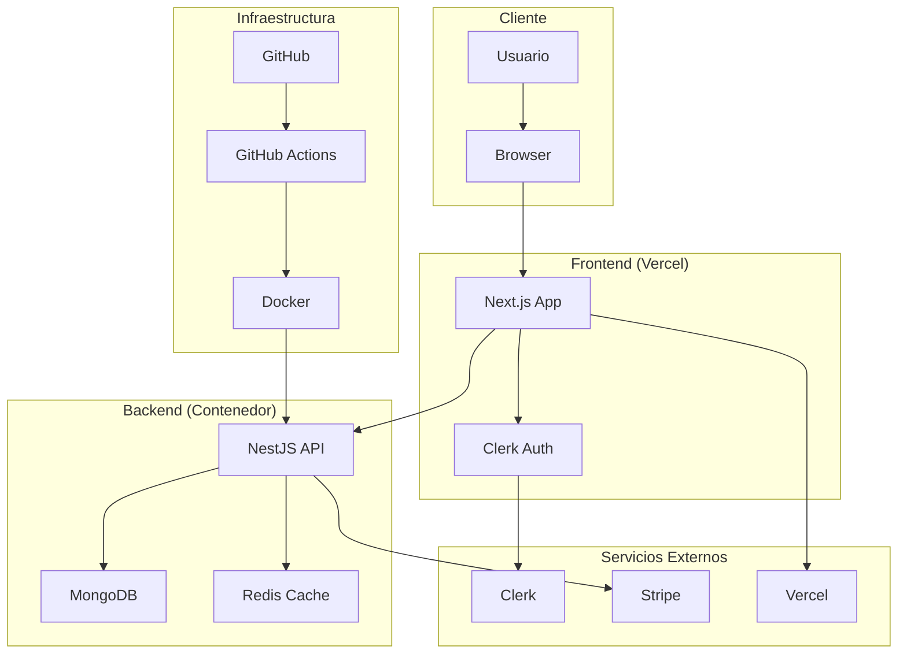
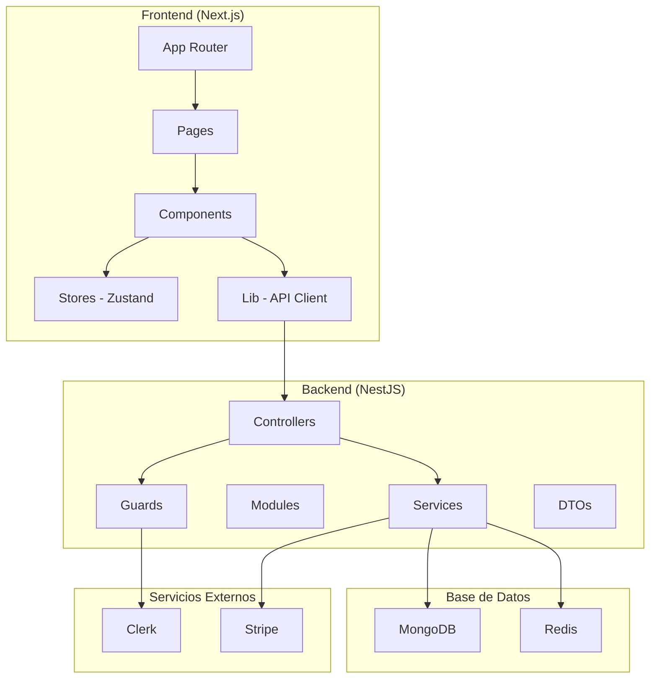

# Arquitectura Técnica - Plataforma GRAVITAD MVP

## Diagrama de Arquitectura Nivel 0



## Diagrama de Arquitectura Nivel 1



## Estructura del Monorepo

```
[Proyecto Gamificacion]/006-gravitad-mvp/
├── apps/
│   ├── frontend/                 # Next.js 15 + App Router
│   │   ├── src/
│   │   │   ├── app/             # App Router pages
│   │   │   │   ├── (auth)/      # Auth group
│   │   │   │   ├── dashboard/   # Dashboard pages
│   │   │   │   ├── games/       # Games pages
│   │   │   │   └── wallet/      # Wallet pages
│   │   │   ├── components/      # React components
│   │   │   │   ├── ui/          # Shadcn/UI components
│   │   │   │   ├── tasks/       # Task-specific components
│   │   │   │   └── payments/    # Payment components
│   │   │   ├── lib/             # Utilities and API client
│   │   │   ├── stores/          # Zustand stores
│   │   │   └── types/           # Frontend-specific types
│   │   ├── public/              # Static assets
│   │   └── package.json
│   └── backend/                 # NestJS API
│       ├── src/
│       │   ├── modules/         # Feature modules
│       │   │   ├── auth/        # Authentication module
│       │   │   ├── users/       # User management
│       │   │   ├── games/       # Games module
│       │   │   ├── tasks/       # Tasks module
│       │   │   ├── rewards/     # Rewards module
│       │   │   ├── wallets/     # Wallet module
│       │   │   ├── payments/    # Payments module
│       │   │   ├── rankings/    # Leaderboards module
│       │   │   └── webhooks/    # Webhook handlers
│       │   ├── common/          # Shared utilities
│       │   │   ├── guards/      # Auth guards
│       │   │   ├── interceptors/# HTTP interceptors
│       │   │   ├── pipes/       # Validation pipes
│       │   │   └── decorators/  # Custom decorators
│       │   ├── config/          # Configuration files
│       │   └── main.ts          # Application entry point
│       └── package.json
├── packages/
│   ├── common-types/            # Shared TypeScript types
│   │   ├── src/
│   │   │   ├── interfaces/      # DTOs and interfaces
│   │   │   │   ├── user.interface.ts
│   │   │   │   ├── task.interface.ts
│   │   │   │   ├── wallet.interface.ts
│   │   │   │   └── transaction.interface.ts
│   │   │   └── index.ts         # Barrel exports
│   │   └── package.json
│   ├── ui/                      # Shared UI components
│   │   ├── src/
│   │   │   ├── components/
│   │   │   └── index.ts
│   │   └── package.json
│   └── config/                  # Shared configurations
│       ├── eslint-preset.js
│       ├── tsconfig.base.json
│       └── package.json
├── infra/                       # Infrastructure files
│   ├── docker-compose.yml
│   ├── Dockerfile.backend
│   └── Dockerfile.frontend
├── docs/                        # Documentation
│   ├── api/                     # API documentation
│   ├── architecture/            # Architecture docs
│   └── deployment/              # Deployment guides
├── scripts/                     # Automation scripts
│   ├── check-env.ts
│   └── deploy.sh
├── .github/
│   └── workflows/
│       ├── ci.yml
│       └── cd.yml
├── pnpm-workspace.yaml
├── package.json
├── .env.example
└── README.md
```

## Módulos del Backend

### 1. Auth Module

```typescript
// Responsabilidades:
- Verificación de tokens JWT de Clerk
- Guards de autenticación
- Middleware de autorización
- Sincronización de usuarios con webhooks
```

### 2. Users Module

```typescript
// Responsabilidades:
- CRUD de perfiles de usuario
- Gestión de preferencias
- Historial de actividad
- Validación de datos de usuario
```

### 3. Games Module

```typescript
// Responsabilidades:
- CRUD de juegos
- Validación de reglas de juego
- Gestión de categorías
- Configuración de dificultad
```

### 4. Tasks Module

```typescript
// Responsabilidades:
- CRUD de tareas
- Validación de completación
- Tracking de progreso
- Asignación de recompensas
```

### 5. Rewards Module

```typescript
// Responsabilidades:
- Cálculo de recompensas
- Validación de elegibilidad
- Gestión de tipos de recompensa
- Historial de recompensas
```

### 6. Wallets Module

```typescript
// Responsabilidades:
- Gestión de saldo
- Historial de transacciones
- Validación de límites
- Operaciones atómicas
```

### 7. Payments Module

```typescript
// Responsabilidades:
- Integración con Stripe
- Procesamiento de pagos
- Webhook handlers
- Reconciliación de transacciones
```

### 8. Rankings Module

```typescript
// Responsabilidades:
- Cálculo de leaderboards
- Cache en Redis
- Jobs programados
- Métricas de gamificación
```

## Contratos de API

### Endpoints de Autenticación

```
GET    /auth/profile           # Obtener perfil del usuario
PUT    /auth/profile           # Actualizar perfil
DELETE /auth/account           # Eliminar cuenta
POST   /webhooks/clerk         # Webhook de Clerk
```

### Endpoints de Juegos y Tareas

```
GET    /games                  # Listar juegos disponibles
GET    /games/:id              # Obtener detalles de juego
POST   /games/:id/join         # Unirse a un juego
GET    /tasks                  # Listar tareas del usuario
GET    /tasks/:id              # Obtener detalles de tarea
POST   /tasks/:id/complete     # Completar tarea
GET    /tasks/:id/rewards      # Ver recompensas de tarea
```

### Endpoints de Wallet y Pagos

```
GET    /wallet                 # Obtener saldo y transacciones
POST   /wallet/deposit         # Cargar fondos
POST   /wallet/withdraw        # Retirar fondos
GET    /transactions           # Historial de transacciones
POST   /payments/create-intent # Crear PaymentIntent
POST   /webhooks/stripe        # Webhook de Stripe
```

### Endpoints de Rankings

```
GET    /rankings               # Obtener leaderboards
GET    /rankings/user/:id      # Ranking específico de usuario
GET    /rankings/global        # Ranking global
GET    /rankings/weekly        # Ranking semanal
```

## Eventos Asíncronos (NestJS Events)

### Eventos de Usuario

```typescript
// Evento: user.created
- Emisor: Clerk webhook
- Escuchado por: UsersService, WalletsService
- Acción: Crear perfil y wallet inicial

// Evento: user.updated
- Emisor: UsersService
- Escuchado por: RankingsService
- Acción: Actualizar métricas de usuario
```

### Eventos de Tareas

```typescript
// Evento: task.completed
- Emisor: TasksService
- Escuchado por: RewardsService, WalletsService, RankingsService
- Acción: Otorgar recompensa, actualizar saldo, recalcular rankings

// Evento: reward.claimed
- Emisor: RewardsService
- Escuchado por: WalletsService
- Acción: Añadir puntos al wallet
```

### Eventos de Pagos

```typescript
// Evento: payment.succeeded
- Emisor: PaymentsService (webhook Stripe)
- Escuchado por: WalletsService
- Acción: Actualizar saldo del usuario

// Evento: payment.failed
- Emisor: PaymentsService
- Escuchado por: NotificationsService
- Acción: Notificar al usuario
```

## Configuración de Base de Datos

### MongoDB Collections

```typescript
// users
{
  _id: ObjectId,
  clerkId: string,
  email: string,
  profile: {
    firstName: string,
    lastName: string,
    avatar?: string
  },
  preferences: object,
  createdAt: Date,
  updatedAt: Date
}

// games
{
  _id: ObjectId,
  title: string,
  description: string,
  category: string,
  difficulty: 'easy' | 'medium' | 'hard',
  rules: object,
  rewards: {
    points: number,
    coins: number
  },
  isActive: boolean,
  createdAt: Date
}

// tasks
{
  _id: ObjectId,
  gameId: ObjectId,
  title: string,
  description: string,
  requirements: object,
  rewards: {
    points: number,
    coins: number
  },
  isActive: boolean,
  createdAt: Date
}

// userTasks
{
  _id: ObjectId,
  userId: ObjectId,
  taskId: ObjectId,
  status: 'pending' | 'completed' | 'failed',
  completedAt?: Date,
  evidence?: object,
  reward?: {
    points: number,
    coins: number
  }
}

// wallets
{
  _id: ObjectId,
  userId: ObjectId,
  balance: number,
  totalEarned: number,
  totalSpent: number,
  createdAt: Date,
  updatedAt: Date
}

// transactions
{
  _id: ObjectId,
  userId: ObjectId,
  type: 'deposit' | 'withdrawal' | 'reward' | 'payment',
  amount: number,
  status: 'pending' | 'completed' | 'failed',
  description: string,
  metadata?: object,
  createdAt: Date
}
```

### Redis Cache

```typescript
// Leaderboards
key: "leaderboard:global"
key: "leaderboard:weekly"
key: "leaderboard:monthly"
TTL: 1 hour

// User sessions
key: "session:{userId}"
TTL: 24 hours

// Rate limiting
key: "rate_limit:{userId}:{endpoint}"
TTL: 1 minute
```

## Configuración de Seguridad

### Guards y Middlewares

```typescript
// ClerkAuthGuard
- Verifica JWT token de Clerk
- Extrae información del usuario
- Valida permisos

// StripeWebhookGuard
- Verifica firma de webhook
- Valida payload
- Previene replay attacks

// ThrottlerGuard
- Rate limiting por IP y usuario
- Configuración por endpoint
- Bloqueo temporal por abuso
```

### Validaciones

```typescript
// DTOs con class-validator
- Validación automática en endpoints
- Sanitización de inputs
- Transformación de datos

// Esquemas MongoDB
- Validación de estructura
- Índices únicos
- Constraints de integridad
```

## Monitoreo y Observabilidad

### Logging (Pino)

```typescript
// Logs estructurados
- Request/Response logging
- Error tracking
- Performance metrics
- Security events

// Niveles de log
- ERROR: Errores críticos
- WARN: Advertencias
- INFO: Información general
- DEBUG: Debugging
```

### Métricas

```typescript
// KPIs del negocio
- Usuarios activos diarios (DAU)
- Tareas completadas por día
- Volumen de transacciones
- Tasa de conversión

// Métricas técnicas
- Response time por endpoint
- Error rate por servicio
- Throughput de requests
- Uso de recursos
```

## Deployment y CI/CD

### GitHub Actions Workflow

```yaml
# CI Pipeline
1. Lint y format check
2. Type checking
3. Unit tests
4. Build applications
5. Security audit

# CD Pipeline
1. Build Docker images
2. Push to registry
3. Deploy to staging
4. Run smoke tests
5. Deploy to production
```

### Docker Configuration

```dockerfile
# Multi-stage build para optimización
- Stage 1: Build de dependencias
- Stage 2: Build de aplicación
- Stage 3: Runtime image

# Variables de entorno
- Database connection
- API keys
- Feature flags
```
