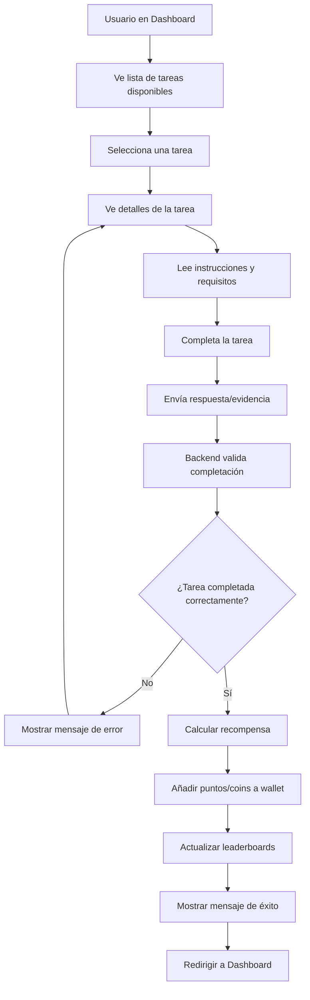
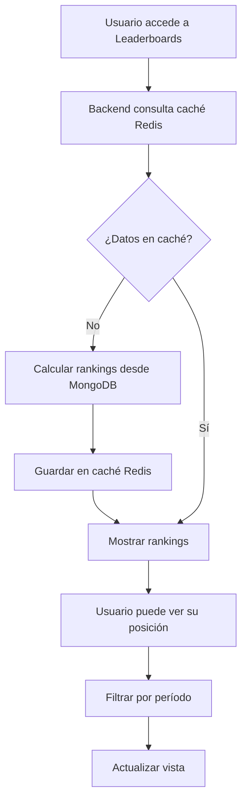

# Flujos Críticos de Usuario - Plataforma GRAVITAD MVP

## 1. Flujo de Registro/Login

```mermaid
graph TD
    A[Usuario accede a la plataforma] --> B{¿Está autenticado?}
    B -->|No| C[Mostrar página de login]
    C --> D[Usuario hace clic en "Sign In"]
    D --> E[Clerk maneja autenticación]
    E --> F{¿Primera vez?}
    F -->|Sí| G[Registro en Clerk]
    F -->|No| H[Login en Clerk]
    G --> I[Webhook: user.created]
    H --> I
    I --> J[Backend crea perfil en MongoDB]
    J --> K[Crear wallet inicial]
    K --> L[Redirigir a Dashboard]
    B -->|Sí| L
```

## 2. Flujo de Completar una Tarea



## 3. Flujo de Retirar Fondos

```mermaid
graph TD
    A[Usuario accede a Wallet] --> B[Ve saldo actual]
    B --> C[Selecciona "Retirar fondos"]
    C --> D[Ingresa monto a retirar]
    D --> E[Valida monto mínimo]
    E --> F{¿Monto válido?}
    F -->|No| G[Mostrar error]
    F -->|Sí| H[Selecciona método de pago]
    H --> I[Ingresa datos bancarios/cuenta]
    I --> J[Confirma retiro]
    J --> K[Backend procesa solicitud]
    K --> L[Crear transacción pendiente]
    L --> M[Notificar a admin]
    M --> N[Admin revisa y aprueba]
    N --> O[Procesar pago vía Stripe]
    O --> P[Actualizar wallet del usuario]
    P --> Q[Enviar confirmación]
    Q --> R[Mostrar mensaje de éxito]
    G --> D
```

## 4. Flujo de Cargar Fondos (Wallet)

```mermaid
graph TD
    A[Usuario en Wallet] --> B[Selecciona "Cargar fondos"]
    B --> C[Ingresa monto a cargar]
    C --> D[Valida monto mínimo]
    D --> E{¿Monto válido?}
    E -->|No| F[Mostrar error]
    E -->|Sí| G[Redirige a Stripe Checkout]
    G --> H[Usuario ingresa datos de tarjeta]
    H --> I[Stripe procesa pago]
    I --> J{¿Pago exitoso?}
    J -->|No| K[Mostrar error de pago]
    J -->|Sí| L[Webhook: payment.succeeded]
    L --> M[Backend actualiza wallet]
    M --> N[Crear transacción]
    N --> O[Redirigir a Wallet]
    O --> P[Mostrar saldo actualizado]
    F --> C
    K --> G
```

## 5. Flujo de Ver Leaderboards


